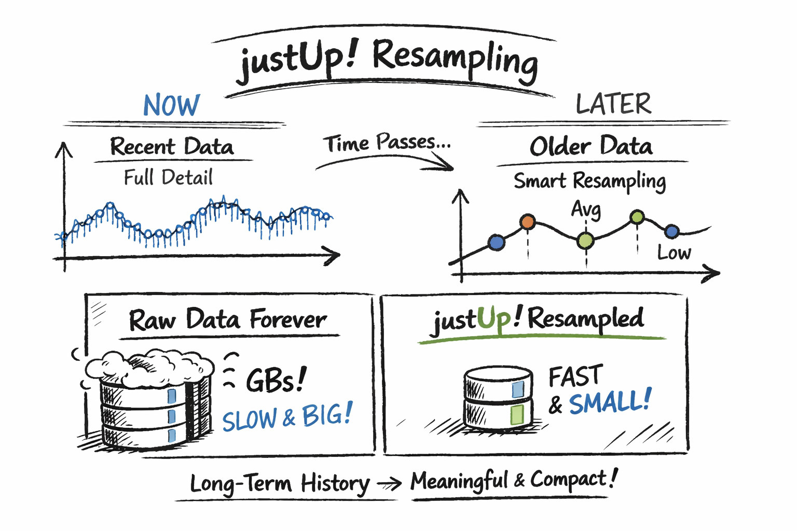

# justUp

Seriously?! Why another monitoring tool?

The answer is simple:
I was looking for an easy-to-use monitoring tool for websites and endpoints that could run in Docker.

The following requirements were essential:
- No external dependencies on Postgres, Influx, etc.
- Runs entirely in Docker, comes with everything it needs
- A sleek dashboard with meaningful metrics, without Grafana overkill
- Reliable alerting (currently Signal integrated)
- Measurement points in a resampled time series database
- Professional PDF reports

## All this is justUp!

- Signal integration for alerts/notifications
- Quality Score to track overall network/service quality at a glance
- High-quality PDF reports (charts + traceroute map) for audits and sharing
- Integrated traceroute (UI + PDF) to visualize the network path
- Fully responsive web UI (works well on desktop, tablet, mobile)

## What you get

- Checks: HTTP, Ping, TCP port, TLS certificate expiry
- Dashboard + charts
- Alerts + recipients
- Traceroute (UI + PDF map)
- PDF reports

## FAQ

<details>
<summary><strong>What is the Quality Score?</strong></summary>


Suppose your monitor's Internet connection is disrupted or even fails. Virtually all monitoring solutions evaluate the failure of the endpoint.

justUp! is different! justUp! continuously measures its own Internet quality using a sophisticated and advanced algorithm. Various endpoints are weighted so cleverly that objective connection quality can be derived from this. If the connection quality falls below a certain threshold, the measuring point is marked as "unknown."

</details>

<details>
<summary><strong>What is Resampling?</strong></summary>



Instead of storing every single measurement forever and filling up gigabytes of database space, measurement points are resampled over time.

**What does that mean?**

Recent data is stored with full detail. As data gets older, justUp! automatically keeps fewer, representative points that preserve trends, averages, and extremes. You still see what happened, but without wasting storage on unnecessary granularity.

**Result:** Long-term history stays meaningful, fast, and compact — without manual cleanup or data loss where it matters.

</details>

## Requirements

- Docker Engine (and optionally Docker Compose)
- A persistent directory/volume for `/app/data`

## Quick start (Docker)

1) Create an encryption key (required)

```bash
docker run --rm python:3.12-slim \
  python -c "from cryptography.fernet import Fernet; print(Fernet.generate_key().decode())"
```

2) Run the container

Run the container:

```bash
docker run -d --name justup \
  -p 8080:8080 \
  -e TZ=UTC \
  -e PUID=1000 \
  -e PGID=1000 \
  -e LOG_LEVEL=INFO \
  -e UPMON_ENCRYPTION_KEY="<YOUR_FERNET_KEY>" \
  -v "$PWD/justup-data:/app/data" \
  --restart unless-stopped \
  gill-bates/justup:latest
```

Open:

- UI: `http://localhost:8080/`
- Health: `http://localhost:8080/health`

## Default login

- Username: `admin`
- Password: `admin`

Change the password immediately after first login.

## Docker Compose (recommended)

Create a `docker-compose.yml` like this:

```yaml
services:
  justup:
    image: gill-bates/justup:latest
    container_name: justup
    restart: unless-stopped
    ports:
      - "8080:8080"
    environment:
      TZ: "UTC"
      PUID: "1000"
      PGID: "1000"
      LOG_LEVEL: "INFO"
      UPMON_ENCRYPTION_KEY: "<YOUR_FERNET_KEY>"
      # Optional paths (defaults are fine when you mount /app/data)
      UPMON_DATA_DIR: "data/"
      UPMON_DB_PATH: "data/sqlite/app.sqlite3"
      UPMON_TSDB_DIR: "data/tsdb"
    volumes:
      - ./justup-data:/app/data
    healthcheck:
      test: ["CMD", "curl", "-fsS", "http://localhost:8080/health"]
      interval: 30s
      timeout: 5s
      retries: 3
      start_period: 10s
```

Start:

```bash
docker compose up -d
```

## Updating

Before updating, it’s recommended to back up your data directory (especially `data/sqlite/app.sqlite3`).

```bash
docker compose pull
docker compose up -d
```

## Data persistence (important)

All runtime state lives under `/app/data`:

- SQLite DB: users/settings/targets
- TSDB: metrics data
- Generated reports

If you don’t mount `/app/data`, you’ll lose everything on container recreation.

## Configuration reference (most used)

| Variable | Required | Default | Meaning |
|---|---:|---|---|
| `UPMON_ENCRYPTION_KEY` | yes | — | Encrypts secrets at rest (Fernet) |
| `LOG_LEVEL` | no | `INFO` | Logging verbosity |
| `PUID` / `PGID` | no | `1000` | File ownership for `/app/data` |
| `JUSTUP_HOST` | no | `0.0.0.0` | Bind address |
| `JUSTUP_PORT` | no | `8080` | Listen port |
| `UPMON_QUALITY_TARGETS` | no | `1.1.1.1,8.8.8.8,9.9.9.9,www.de-cix.net,cloudflare.com` | Comma-separated hosts used by the “quality probe” |

## Troubleshooting

### Container starts but can’t write data

- Ensure the host directory you mount to `/app/data` is writable.
- Use `PUID`/`PGID` matching the directory owner.

### “Missing encryption key” / startup aborts

- `UPMON_ENCRYPTION_KEY` is mandatory.
- Keep it stable across upgrades. Changing it can make stored secrets unreadable.

### Healthcheck

- `GET /health` should return `200 OK`.
- Logs: `docker logs -f justup`
